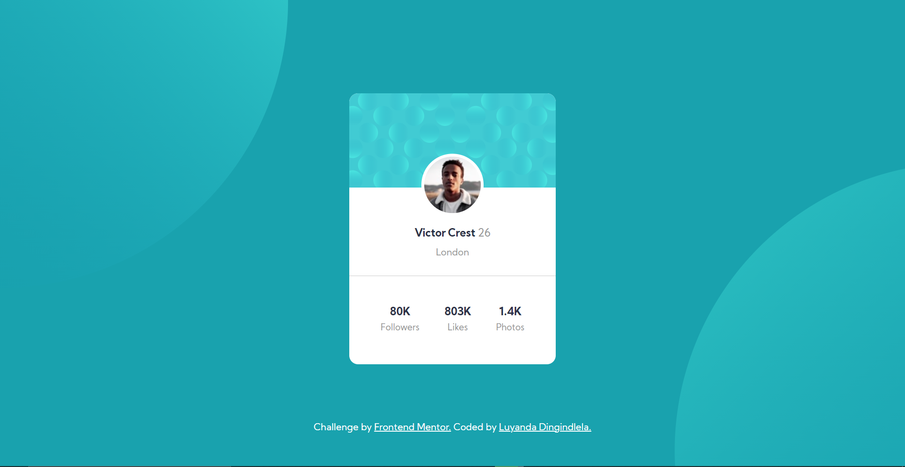

## Table of contents
- [Overview](#overview)
  - [The challenge](#the-challenge)
  - [Screenshot](#screenshot)
  - [Links](#links)
- [Author](#author)

## Overview

### The challenge
Users should be able to:

- View the optimal layout depending on their device's screen size
- See hover states for interactive elements

### Screenshot

### Links
- Solution URL: [Github link](https://github.com/LuyandaDingindlela101/Profile-card-component)
- Live Site URL: [Netlify link](https://awesome-profile-card-component.netlify.app/)

## Author
- Website - [Luyanda Dingindlela](https://luyanda-portfolio.netlify.app/)
- Frontend Mentor - [@LuyandaDingindlela101](https://www.frontendmentor.io/profile/LuyandaDingindlela101)
